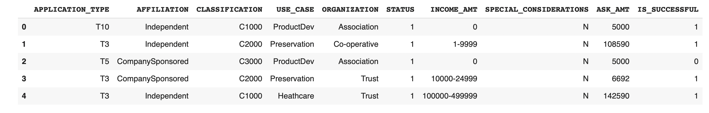
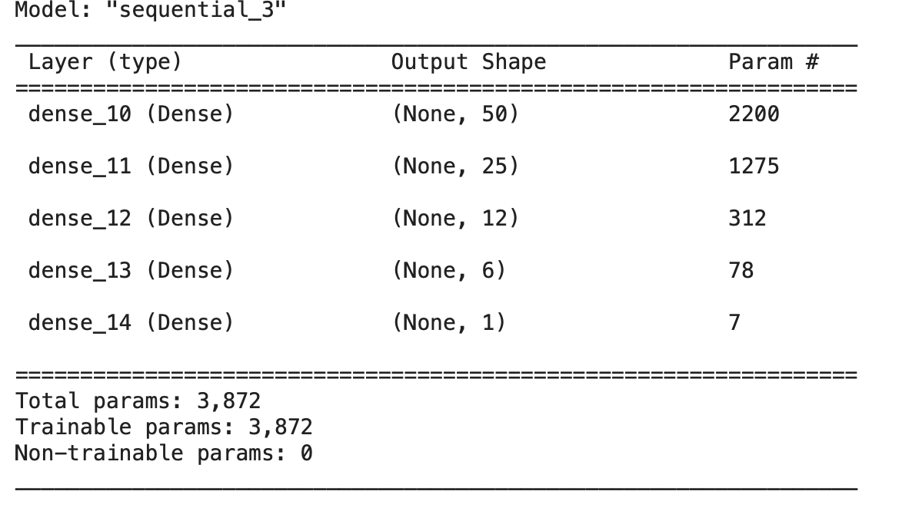
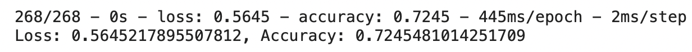

## Neural_Network_Charity_Analysis

# Overview
The purpose of this analysis is to better identify which charitites will be successful if funded by Alphabet Soup. This will be done by building a machine learning model and identifying which variables have the most predicitve power.

# Results

*Data Preprocessing*

- The target variable in this model is "IS_SUCCESSFUL", a binary flag that shows if the organization was sucessful in its goals.
- The feature variables of this model are "APPLICATION_TYPE", "AFFLIATION", "CLASSIFICATION", "USE_CASE", "ORGANIZATION", "STATUS", "INCOME_AMT", "SPECIAL_CONSIDERATIONS", "ASK_AMT"
- In order to improve the accuracy of the model some variables were removed, including "EIN" and "NAME".

Thus, after data cleaning, the dataset looked like the below:

*Compiling, Training, and Evaluating the Model*

How many neurons, layers, and activation functions did you select for your neural network model, and why?
- In the end, I used a model that contained 93 neurons, with three hidden layers. I used RELU as the activation function, as it is most appropriate for the binary (successful / not sucessful) result we were looking for.

Were you able to achieve the target model performance?
- I was not able ot reach the goal of 75% accuracy, instead hovering around 73% with the various methods attempted.

What steps did you take to try and increase model performance?
- Initially I simply added additional epochs to the model, pushing it to 500. This resulted in a gain of 1%.
- I then added an additional hidden layer. This had almost no effect.
- I then combined these methods, increasing the number of epochs to 250 (from 100 in the original model), increasing the number of hidden layers, and increasing the number of neurons in each layer.

# Summary
Despite all of this though, none of these models ever reached the target 75% accuracy score. Therefore additional steps are presumably needed in the initial data cleaning steps. It seems likely that there are additional columns that could be deleted from our dataframe, in an effort to further refine our model.
